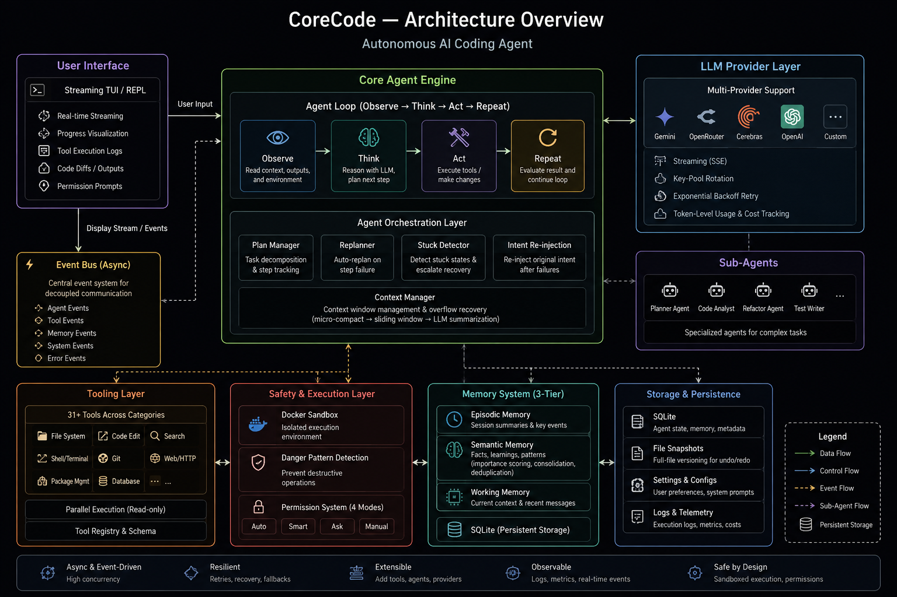

# CoreCode

AI-powered coding agent built from scratch — reads, edits, and executes code in your workspace with multi-provider LLM support, Docker sandboxing, and a terminal UI.

## Demo

https://github.com/user-attachments/assets/fd5c46c6-98f3-47c8-8e74-0aa89766d8ac

## Features

| Capability | Description |
|---|---|
| **Multi-provider LLM** | Gemini, OpenRouter, Cerebras, ZenMux, OmniRoute with API key pool rotation |
| **Docker sandbox** | Shell commands run in isolated containers with resource limits |
| **File operations** | Read, write, edit with diff preview and syntax verification |
| **Code search** | Content search (ripgrep) and file search (glob) |
| **Git operations** | Status, diff, log, commit |
| **Streaming** | Token-by-token output in real time |
| **Permission system** | Auto-approve, per-operation confirm, or deny modes |
| **Session persistence** | Conversation history saved to SQLite, resume anytime |
| **Undo/redo** | File-snapshot-based undo with disk persistence and session isolation |
| **Subagents** | Spawn child agents for parallel or isolated tasks |
| **Plan/Build mode** | Read-only planning phase vs. execution phase |
| **Context management** | Summarization, micro-compact, reactive compact, sliding window |
| **Budget controls** | Cost and time limits per session with graceful cutoff |
| **Semantic memory** | Remembers decisions and patterns across sessions |
| **Hooks** | Pre/post tool execution callbacks for custom validation |
| **Post-edit verification** | Automatic syntax and lint checks after file edits |
| **Reflector** | Stuck detection, failure assessment, and recovery strategies |
| **Custom TUI** | Textual-based interface with session browser, diff viewer, status panel, and plan panel |

## Quick Start

```bash
cd coding-agent

# Install
uv sync

# Configure
cp .env.example .env
# Edit .env — set your provider and API key (see Configuration below)

# Run with a prompt
uv run coding-agent run --prompt "Read the README and summarize it"

# Interactive REPL
uv run coding-agent repl

# Full TUI with session browser
uv run coding-agent tui
```

## Architecture



The agent follows an **observe → think → act** loop. User input flows through the CLI/TUI into the Agent Loop, which orchestrates everything: querying LLM providers, routing tool calls through the registry, managing context, and persisting state.

| Layer | Components |
|---|---|
| **Interface** | CLI (Typer) for one-shot commands, TUI (Textual) for interactive sessions |
| **Core** | Agent Loop, Context Engine, Permissions, Reflector, Verifier, Hook Manager |
| **LLM** | Gemini, OpenRouter, Cerebras, ZenMux, OmniRoute with API key pool rotation |
| **Tools** | File Ops, Search, Shell, Git, Planning, Memory, SubAgent, Undo, and more |
| **Infrastructure** | Docker Sandbox (isolated execution), SQLite (sessions), Memory Store (semantic) |

### Agent Loop Flow

The agent loop runs an **observe → think → act** cycle:

1. **Observe** — Build system prompt, select prioritized context via Smart Context Engine, load session history
2. **Think** — Stream response from LLM, parse tool calls, check budget, run reflector for stuck detection
3. **Act** — Check permissions → pre-hooks → dispatch tool via registry → post-hooks → verify syntax → snapshot for undo → check if more calls remain → loop back or return response

## CLI Commands

| Command | Description |
|---|---|
| `run` | Execute a single prompt and exit |
| `repl` | Start an interactive REPL session |
| `tui` | Launch the unified TUI with session browser |
| `resume [ID]` | Resume a previous session (interactive picker if no ID) |
| `browse` | Browse and resume sessions via visual TUI |
| `history` | List past session history |
| `checkpoints` | List undo history |
| `undo` | Undo the last file mutation |
| `redo` | Redo the last undone mutation |
| `config` | Show current configuration |
| `version` | Show version information |
| `reset` | Reset session state (archive plan, optionally clear memories) |

### Key Flags

```bash
# Permission modes
--permission auto     # Auto-approve safe operations (default)
--permission confirm  # Ask before every write/execute
--permission deny     # Block all write/execute operations

# Session management
--continue            # Continue the most recent session
--resume <ID>         # Resume a specific session by ID

# Output and debugging
--format clean        # Structured output (default)
--format raw          # Inline log output
--verbose / -v        # Debug-level logging
--log-file <path>     # Write logs to file
```

## Configuration

Copy `.env.example` to `.env` and configure your provider:

```bash
# Provider selection: gemini | openrouter | cerebras | zenmux | omniroute
CODING_AGENT_LLM_PROVIDER=gemini

# Gemini (Google AI Studio)
CODING_AGENT_LLM_MODEL=gemini-2.5-flash
CODING_AGENT_LLM_API_KEY=your-key-here

# OpenRouter (OpenAI-compatible proxy)
# CODING_AGENT_OPENROUTER_API_KEY=sk-or-v1-xxxx
# CODING_AGENT_OPENROUTER_MODEL=openai/gpt-4o-mini

# Cerebras (fast inference)
# CODING_AGENT_CEREBRAS_API_KEY=csk-xxxx
# CODING_AGENT_CEREBRAS_MODEL=llama-3.3-70b

# ZenMux (OpenAI-compatible proxy)
# CODING_AGENT_ZENMUX_API_KEY=sk-ai-v1-xxxx
# CODING_AGENT_ZENMUX_MODEL=stepfun/step-3.7-flash-free

# OmniRoute (free AI gateway)
# CODING_AGENT_OMNIROUTE_API_KEY=your-key
# CODING_AGENT_OMNIROUTE_MODEL=auto
```

### API Key Pool Rotation

All providers support comma-separated key pools for automatic rotation on rate limits:

```bash
CODING_AGENT_LLM_API_KEY=key1,key2,key3,key4,key5
```

### Budget Controls

```bash
CODING_AGENT_MAX_COST_PER_SESSION=5.0   # Max cost in USD
CODING_AGENT_MAX_TIME_PER_TASK=300       # Max time in seconds
```

### Sandbox Settings

```bash
CODING_AGENT_EXEC_MODE=sandbox           # sandbox (Docker) or host (direct)
CODING_AGENT_SANDBOX_TIMEOUT=30          # Command timeout in seconds
CODING_AGENT_SANDBOX_MEMORY_LIMIT=512m   # Container memory limit
```

### Other Options

```bash
CODING_AGENT_MAX_ITERATIONS=0            # 0 = unlimited (budget is primary limit)
CODING_AGENT_MAX_TOKENS=100000           # Context window size
CODING_AGENT_PERMISSION_LEVEL=write      # Default permission level
CODING_AGENT_LOG_LEVEL=INFO              # Log verbosity
CODING_AGENT_VERIFY_AFTER_EDIT=true      # Syntax check after edits
```

## Project Structure

```
CoreCode/
├── coding-agent/                # Main agent application
│   ├── src/coding_agent/
│   │   ├── main.py              # CLI entry point (Typer app)
│   │   ├── config.py            # Pydantic settings (env + .env)
│   │   ├── logging.py           # Structured logging setup
│   │   │
│   │   ├── agent/               # Core orchestration
│   │   │   ├── loop.py          # Agent loop (observe → think → act)
│   │   │   ├── context.py       # Context window management
│   │   │   ├── context_engine.py # Context health monitoring
│   │   │   ├── context_limits.py # Token limit enforcement
│   │   │   ├── permissions.py   # Permission system
│   │   │   ├── permission_callback.py # Auto-approve / prompt callbacks
│   │   │   ├── planner.py       # Plan/Build mode
│   │   │   ├── reflector.py     # Stuck detection and recovery
│   │   │   ├── verifier.py      # Post-edit syntax/lint checks
│   │   │   ├── subagent.py      # Subagent spawning and coordination
│   │   │   ├── undo.py          # File-snapshot undo/redo
│   │   │   ├── memory.py        # Semantic memory manager
│   │   │   ├── system_prompt.py # System prompt construction
│   │   │   ├── agents_md.py     # AGENTS.md loading
│   │   │   ├── workspace_index.py # Workspace file indexing
│   │   │   ├── disk_store.py    # Disk-based persistence
│   │   │   ├── error_recovery.py # Error classification and recovery
│   │   │   ├── ast_check.py     # AST-based syntax checking
│   │   │   └── events.py        # Event types for agent communication
│   │   │
│   │   ├── llm/                 # LLM provider abstraction
│   │   │   ├── client.py        # Multi-provider LLM client
│   │   │   ├── models.py        # Model registry and configuration
│   │   │   ├── key_pool.py      # API key pool with rotation
│   │   │   ├── streaming.py     # Stream handling
│   │   │   └── tokens.py        # Token counting and cost tracking
│   │   │
│   │   ├── tools/               # Tool implementations
│   │   │   ├── registry.py      # Tool registration and dispatch
│   │   │   ├── schema.py        # JSON schema generation for LLM
│   │   │   ├── base.py          # Base tool class
│   │   │   ├── file_ops.py      # Read/write/edit files
│   │   │   ├── search.py        # ripgrep + glob search
│   │   │   ├── shell.py         # Shell command execution
│   │   │   ├── git.py           # Git operations
│   │   │   ├── planning.py      # Plan creation and management
│   │   │   ├── memory.py        # Memory read/write tool
│   │   │   ├── todo.py          # Todo list management
│   │   │   ├── scratchpad.py    # Scratchpad for notes
│   │   │   ├── undo.py          # Undo/redo tool
│   │   │   ├── workspace.py     # Workspace exploration
│   │   │   ├── count_tokens.py  # Token counting tool
│   │   │   └── subagent.py      # Subagent delegation tool
│   │   │
│   │   ├── sandbox/             # Docker sandbox
│   │   │   ├── docker.py        # Container lifecycle management
│   │   │   ├── executor.py      # Sandboxed command execution
│   │   │   ├── danger_patterns.py # Dangerous command detection
│   │   │   └── protected_paths.py # Critical path protection
│   │   │
│   │   ├── session/             # Persistence
│   │   │   └── manager.py       # SQLite session and memory storage
│   │   │
│   │   ├── commands/            # Slash commands
│   │   │   ├── registry.py      # Command registration
│   │   │   ├── builtin.py       # Built-in commands (/help, /clear, etc.)
│   │   │   └── types.py         # Command type definitions
│   │   │
│   │   ├── hooks/               # Pre/post execution hooks
│   │   │   ├── manager.py       # Hook registration and execution
│   │   │   ├── executor.py      # Hook runner
│   │   │   └── types.py         # Hook type definitions
│   │   │
│   │   └── tui/                 # Terminal UI
│   │       ├── app.py           # Main Textual application
│   │       ├── repl.py          # Interactive REPL mode
│   │       ├── browser.py       # Session browser
│   │       ├── theme.py         # Color theme
│   │       ├── events.py        # TUI event handling
│   │       └── widgets/
│   │           ├── diff_viewer.py # File diff display
│   │           ├── status_panel.py # Agent status display
│   │           └── plan_panel.py # Plan progress display
│   │
│   ├── tests/                   # Test suite
│   ├── Dockerfile.sandbox       # Sandbox Docker image
│   ├── docker-compose.yml       # Local dev compose
│   ├── .env.example             # Environment variable template
│   └── pyproject.toml           # Project config and dependencies
│
└── Context/                     # Architecture docs, audits (gitignored)
```

## Tech Stack

| Layer | Choice |
|---|---|
| Language | Python 3.12+ |
| Package manager | uv |
| CLI | Typer |
| TUI | Textual |
| LLM providers | google-genai, openai, cerebras-cloud-sdk |
| Async | asyncio throughout |
| File I/O | pathlib + aiofiles |
| Shell execution | asyncio.subprocess |
| Sandboxing | Docker |
| Search | ripgrep (rg) |
| Config | pydantic-settings |
| Validation | Pydantic v2 |
| Database | SQLite + aiosqlite |
| Logging | structlog |
| Testing | pytest + pytest-asyncio |
| Linting | Ruff |
| Type checking | Pyright (strict) |

## Development

```bash
cd coding-agent

# Install with dev dependencies
uv sync --all-extras

# Lint
uv run ruff check src/
uv run ruff format --check src/

# Type check
uv run pyright src/

# Test
uv run pytest -v

# Build sandbox Docker image
docker build -t coding-agent-sandbox:latest -f Dockerfile.sandbox .
```

## License

MIT
